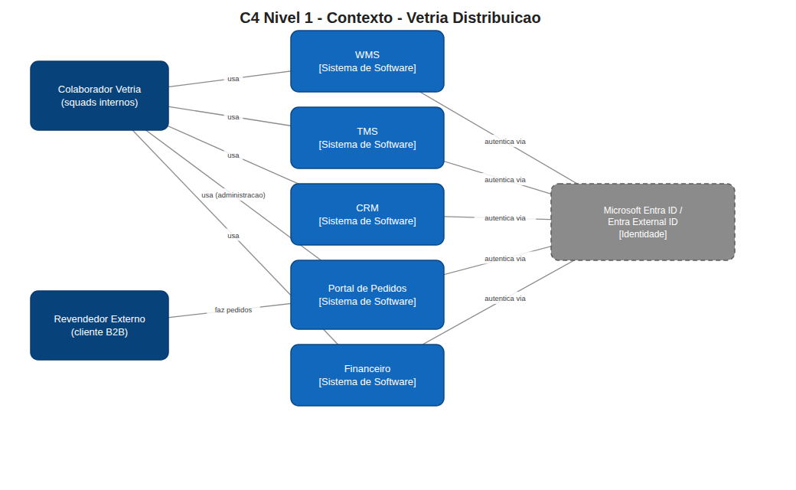
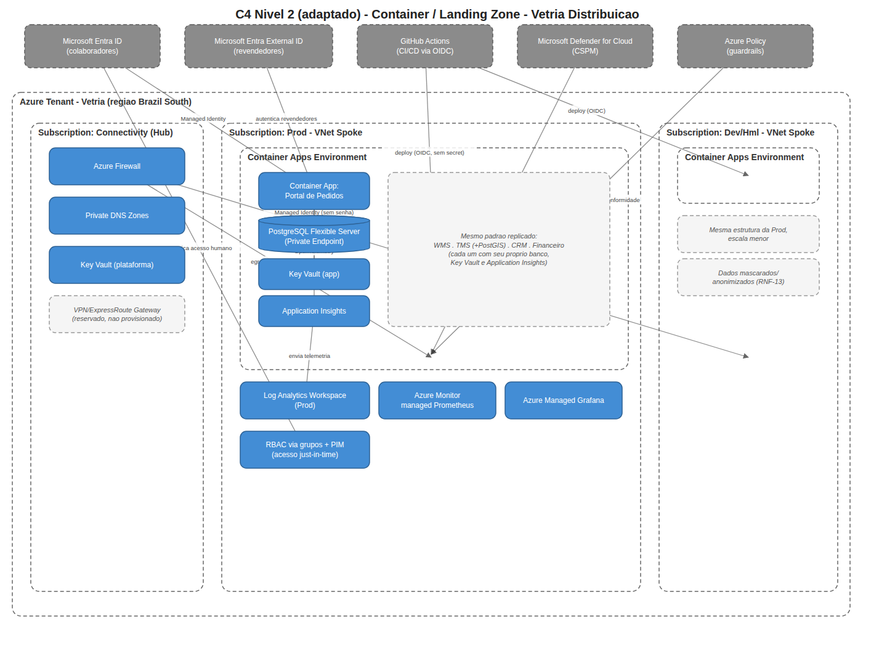
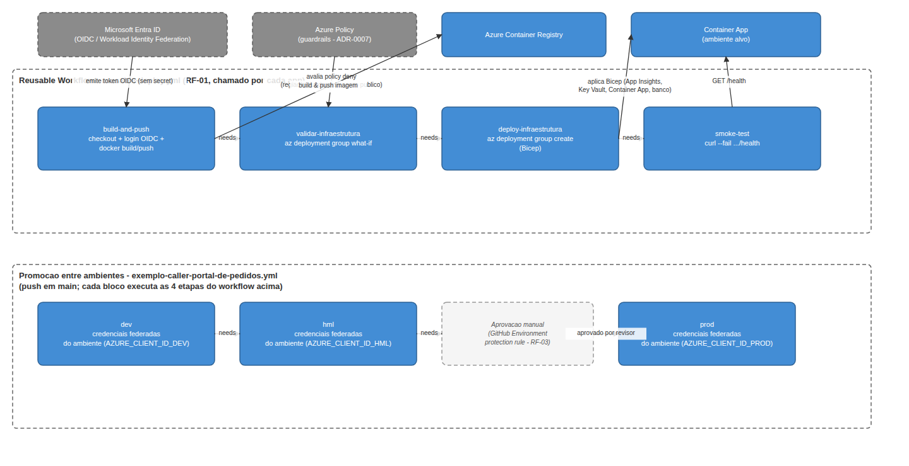

# Diagramas

Diagramas C4 (Contexto e Container/Landing Zone) consolidando as decisões das ADR-0001 a ADR-0008, mais um diagrama de fluxo do pipeline de CI/CD (ADR-0008) no mesmo estilo visual. Cada diagrama existe em duas formas:
- **`.png`** — imagem renderizada, para visualização direta aqui no GitHub.
- **`.drawio`** — fonte editável (formato draw.io / mxGraph XML). Abra com [diagrams.net](https://app.diagrams.net) (importar arquivo) ou a extensão draw.io do VS Code para alterar.

## `c4-contexto.png` / `c4-contexto.drawio` — C4 Nível 1 (Contexto)

Mostra os dois grupos de atores (colaboradores internos e revendedores externos) e as cinco aplicações do portfólio da Vetria como sistemas independentes entre si (RNF-01), todas autenticando via Microsoft Entra ID / Entra External ID (ADR-0005).

## `c4-container-landing-zone.png` / `c4-container-landing-zone.drawio` — C4 Nível 2 adaptado (Container / Landing Zone)

Consolida a infraestrutura decidida nas ADRs em um único diagrama:
- **Subscription Connectivity (hub)**: Azure Firewall, Private DNS Zones, Key Vault de plataforma (ADR-0003).
- **Subscription Prod**: Container Apps Environment com o Portal de Pedidos detalhado como aplicação representativa (Container App, PostgreSQL Flexible Server via Private Endpoint, Key Vault e Application Insights próprios — ADR-0001, ADR-0002, ADR-0003, ADR-0006), com nota indicando que WMS, TMS, CRM e Financeiro replicam o mesmo padrão. Observabilidade compartilhada do ambiente (Log Analytics, managed Prometheus, Managed Grafana — ADR-0002) e RBAC via grupos + PIM (ADR-0005).
- **Subscription Dev/Hml**: mesma estrutura em escala menor, com nota reforçando RNF-13 (dados mascarados/anonimizados).
- **Externos ao tenant**: Microsoft Entra ID/External ID (ADR-0005), GitHub Actions fazendo deploy via OIDC (ADR-0008), Microsoft Defender for Cloud e Azure Policy bloqueando recursos fora de conformidade (ADR-0007).

Toda a estrutura está contida no boundary "Azure Tenant — Vetria (região Brazil South)", reforçando a ADR-0004.

## `pipeline-cicd.png` / `pipeline-cicd.drawio` — Pipeline de CI/CD

Representação visual do que está implementado em `06-implantacao-e-operacao/pipeline/` (ADR-0008), em duas partes:
- **Reusable Workflow (`reusable-deploy.yml`)**: as quatro etapas em sequência — `build-and-push` (login via OIDC/Entra ID, sem client secret — ADR-0005; build e push da imagem no Azure Container Registry), `validar-infraestrutura` (`az deployment group what-if`, onde o Azure Resource Manager falha automaticamente se o Bicep violar uma política `deny` do Azure Policy — região, redundância ou exposição pública — materializando RF-06/ADR-0007), `deploy-infraestrutura` (aplica o Bicep no Container App, ADR-0001/0002/0006) e `smoke-test` (healthcheck HTTP pós-deploy).
- **Promoção entre ambientes (`exemplo-caller-portal-de-pedidos.yml`)**: cada ambiente (dev, hml, prod) chama o workflow acima com suas próprias credenciais federadas (nunca compartilhadas — ADR-0005), encadeados via `needs:`. A promoção para prod passa por uma aprovação manual (GitHub Environment protection rule, RF-03) antes de rodar.
